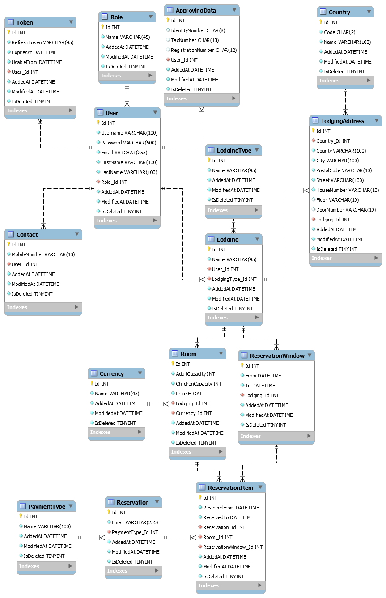

# Hotel5000 rendszerterv

## Bevezetés

### Szójegyzék és rövidítések

Rövidítés | Magyarázat | 
--------- | ----------
interface | nem konkrét programozási értelemben vett interface, hanem az applikáció  vagy komponens egy végpontja, elérési módja |

### Architektúra áttekintése

## Rendszer architektúra

### Szoftver architektúra

#### Komponensek
a fenti diagramból a komponensek leírása

Komponens neve | Magyarázat |
-------------- | ---------- |

#### Interfacek

Azonosító | Név | Magyarázat |
--------- | --- | ---------- |

### Adatbázisréteg felépítése
#### Adatbázis(ok)
##### Domain adatbázis
Tulajdonságok | Konfiguráció |
------------- | ------------ |
Név | LodgingDatabase
Technológia | MSSQL via Code-First EF Core
Collation | Latin1_General_CI_AS
Egyéb |
##### Adatmodell

##### Adatbázis objektumok
Role

Mező név | Típus/hossz | Kötelező | Érték/validáció | Kulcs | Megj. |
-------- | ----------- | -------- | --------------- | ----- | ----- |
Id | int | igen | auto-increment | PK | |
Name | varchar(45) | igen | | | ADMIN, APPROVED_USER, COMPANY |

Role megszorítások

Azonosító | Tábla 1 | Mező 1 | Tábla 2 | Mező 2 | Típus |
--------- | ------- | ------ | ------- | ------ | ----- |
Role_PK | Role | Id | | | PK |

User

Mező név | Típus/hossz | Kötelező | Érték/validáció | Kulcs | Megj. |
-------- | ----------- | -------- | --------------- | ----- | ----- |
Id | int | igen | auto-increment | PK | |
Username | varchar(100) | igen | hossz > 4 | | |
Password | varchar(500) | igen | hossz > 8, tartalmaz 1 számot és nagybetűt | | |
Email | varchar(255) | igen | valid email cím | | |
FirstName | varchar(100) | igen | | | |
LastName | varchar(100) | igen | | | |
Role_Id | int | igen | | FK | |
AddedAt | datetime | igen | | | |
ModifiedAt | datetime | igen | | | |
IsDeleted | int | igen | 0 vagy 1 | | |

User megszorítások

Azonosító | Tábla 1 | Mező 1 | Tábla 2 | Mező 2 | Típus |
--------- | ------- | ------ | ------- | ------ | ----- |
User_PK | User | Id | | | PK |
User_Role_FK | Role | Id | User | Role_Id | FK 1-N |
User_Username_UQ | User | Username | | | UQ |
User_Email_UQ | User | Email | | | UQ |

ApprovingData

Mező név | Típus/hossz | Kötelező | Érték/validáció | Kulcs | Megj. |
-------- | ----------- | -------- | --------------- | ----- | ----- |
Id | int | igen | auto-increment | PK | |
IdentityNumber | char(8) | nem | | | személyi azonosító szám |
TaxNumber | char(13) | nem | | | adószám |
RegistrationNumber | char(12) | nem | | | cégjegyzék szám |
User_Id | int | igen | | FK | |
AddedAt | datetime | igen | | | |
ModifiedAt | datetime | igen | | | |
IsDeleted | int | igen | 0 vagy 1 | | |

ApprovingData megszorítások

Azonosító | Tábla 1 | Mező 1 | Tábla 2 | Mező 2 | Típus |
--------- | ------- | ------ | ------- | ------ | ----- |
ApprovingData_PK | ApprovingData | Id | | | PK |
ApprovingData_User_FK | User | Id | ApprovingData | User_Id | FK 1-1 |
ApprovingData_IdentityNumber_UQ | ApprovingData | IdentityNumber | | | UQ |
ApprovingData_TaxNumber_UQ | ApprovingData | TaxNumber | | | UQ |
ApprovingData_RegistrationNumber_UQ | ApprovingData | RegistrationNumber | | | UQ |

Contact

Mező név | Típus/hossz | Kötelező | Érték/validáció | Kulcs | Megj. |
-------- | ----------- | -------- | --------------- | ----- | ----- |
Id | int | igen | auto-increment | PK | |
MobileNumber | varchar(13) | igen | | | |
User_Id | int | igen | | FK | |
AddedAt | datetime | igen | | | |
ModifiedAt | datetime | igen | | | |
IsDeleted | int | igen | 0 vagy 1 | | |

Contact megszorítások

Azonosító | Tábla 1 | Mező 1 | Tábla 2 | Mező 2 | Típus |
--------- | ------- | ------ | ------- | ------ | ----- |
Contact_PK | Contact | Id | | | PK |
Contact_User_FK | User | Id | Contact | User_Id | FK 1-N |
Contact_MobileNumber_UQ | Contact | MobileNumber | | | UQ |

Token

Mező név | Típus/hossz | Kötelező | Érték/validáció | Kulcs | Megj. |
-------- | ----------- | -------- | --------------- | ----- | ----- |
Id | int | igen | auto-increment | PK | |
RefreshToken | varchar(100) | igen | | | |
User_Id | int | igen | | FK | |
AddedAt | datetime | igen | | | |
ModifiedAt | datetime | igen | | | |
IsDeleted | int | igen | 0 vagy 1 | | |

Token megszorítások

Azonosító | Tábla 1 | Mező 1 | Tábla 2 | Mező 2 | Típus |
--------- | ------- | ------ | ------- | ------ | ----- |
Token_PK | Token | Id | | | PK |
Token_User_Id_FK | User | Id | Token | User_Id | FK 1-N |

LodgingType

Mező név | Típus/hossz | Kötelező | Érték/validáció | Kulcs | Megj. |
-------- | ----------- | -------- | --------------- | ----- | ----- |
Id | int | igen | auto-increment | PK | |
Name | varchar(45) | igen | | | Company \| Private|
AddedAt | datetime | igen | | | |
ModifiedAt | datetime | igen | | | |
IsDeleted | int | igen | 0 vagy 1 | | |

LodgingType megszorítások

Azonosító | Tábla 1 | Mező 1 | Tábla 2 | Mező 2 | Típus |
--------- | ------- | ------ | ------- | ------ | ----- |
LodgingType_PK | LodgingType | Id | | | PK |

Lodging

Mező név | Típus/hossz | Kötelező | Érték/validáció | Kulcs | Megj. |
-------- | ----------- | -------- | --------------- | ----- | ----- |
Id | int | igen | auto-increment | PK | |
Name | varchar(255) | igen | | | | |
User_Id | int | igen | | FK | |
LodgingType_Id | int | igen | | FK | |
AddedAt | datetime | igen | | | |
ModifiedAt | datetime | igen | | | |
IsDeleted | int | igen | 0 vagy 1 | | |

Lodging megszorítások

Azonosító | Tábla 1 | Mező 1 | Tábla 2 | Mező 2 | Típus |
--------- | ------- | ------ | ------- | ------ | ----- |
Lodging_PK | Lodging | Id | | | PK |
Lodging_User_FK | User | Id | Lodging | User_Id | FK 1-N |
Lodging_LodgingType_FK | LodgingType | Id | Lodging | LodgingType_Id | FK 1-N |

Country

Mező név | Típus/hossz | Kötelező | Érték/validáció | Kulcs | Megj. |
-------- | ----------- | -------- | --------------- | ----- | ----- |
Id | int | igen | auto-increment | PK | |
Code | char(2) | igen | | | az ország ISO 3166-1 alpha-2 kódja |
Name | varchar(100) | igen | | | az ország teljes neve |
AddedAt | datetime | igen | | | |
ModifiedAt | datetime | igen | | | |
IsDeleted | int | igen | 0 vagy 1 | | |

Country megszorítások

Azonosító | Tábla 1 | Mező 1 | Tábla 2 | Mező 2 | Típus |
--------- | ------- | ------ | ------- | ------ | ----- |
Country_PK | Country | Id | | | PK |
Country_CountyCode_UQ | Country | Code | | | UQ |
Country_CountryName_UQ | Country | Name | | | UQ |

LodgingAddress

Mező név | Típus/hossz | Kötelező | Érték/validáció | Kulcs | Megj. |
-------- | ----------- | -------- | --------------- | ----- | ----- |
Id | int | igen | auto-increment | PK | |
Country_Id | int | igen | | FK | |
County | varchar(100) | igen | | | |
City | varchar(100) | igen | | | |
PostalCode | varchar(10) | igen | | | irányítószám |
Street | varchar(100) | igen | | | |
HouseNumber | varchar(10) | igen | | | házszám |
Floor | varchar(10) | nem | | | tömbház esetén emelet |
DoorNumber | varchar(10) | nem | | | tömbház/apartman esetén ajtó száma |
Lodgind_Id | int | igen | | FK | |
AddedAt | datetime | igen | | | |
ModifiedAt | datetime | igen | | | |
IsDeleted | int | igen | 0 vagy 1 | | |

LodgingAddress megszorítások

Azonosító | Tábla 1 | Mező 1 | Tábla 2 | Mező 2 | Típus |
--------- | ------- | ------ | ------- | ------ | ----- |
LodgingAddress_PK | LodgingAddress | Id | | | PK |
LodgingAddress_Country_FK | Country | Id | LodgingAddress | Country_Id | FK 1-N |
LodgingAddress_Lodging_FK | Lodging | Id | LodgingAddress | Lodging_Id | FK 1-N |
LodgingAddress_Country_CK | LodgingAddress | Country_Id | | | CK |
LodgingAddress_County_CK | LodgingAddress | County | | | CK |
LodgingAddress_City_CK | LodgingAddress | City | | | CK |
LodgingAddress_PostalCode_CK | LodgingAddress | PostalCode | | | CK |
LodgingAddress_Street_CK | LodgingAddress | Street | | | CK |
LodgingAddress_HouseNumber_CK | LodgingAddress | HouseNumber | | | CK |
LodgingAddress_Floor_CK | LodgingAddress | Floor | | | CK |
LodgingAddress_DoorNumber_CK | LodgingAddress | DoorNumber | | | CK |

Currency

Mező név | Típus/hossz | Kötelező | Érték/validáció | Kulcs | Megj. |
-------- | ----------- | -------- | --------------- | ----- | ----- |
Id | int | igen | auto-increment | PK | |
Name | varchar(10) | igen | | | |
AddedAt | datetime | igen | | | |
ModifiedAt | datetime | igen | | | |
IsDeleted | int | igen | 0 vagy 1 | | |

Currency megszorítások

Azonosító | Tábla 1 | Mező 1 | Tábla 2 | Mező 2 | Típus |
--------- | ------- | ------ | ------- | ------ | ----- |
Currency_PK | Currency | Id | | | PK |
Currency_Name_UQ | Currency | Name | | | UQ | 

Room

Mező név | Típus/hossz | Kötelező | Érték/validáció | Kulcs | Megj. |
-------- | ----------- | -------- | --------------- | ----- | ----- |
Id | int | igen | auto-increment | PK | |
AdultCapacity | int | igen | érték >= 0 | | |
ChildrenCapacity | int | igen | érték >= 0 | | |
Price | float | igen | | | |
Currency_Id | int | igen | | FK | |
Lodging_Id | int | igen | | FK | |
AddedAt | datetime | igen | | | |
ModifiedAt | datetime | igen | | | |
IsDeleted | int | igen | 0 vagy 1 | | |

Room megszorítások

Azonosító | Tábla 1 | Mező 1 | Tábla 2 | Mező 2 | Típus |
--------- | ------- | ------ | ------- | ------ | ----- |
Room_PK | Room | Id | | | PK |
Room_Currency_FK | Currency | Id | Room | Currency_Id | FK 1-N |
Room_Lodging_FK | Lodging | Id | Room | Lodging_Id | FK 1-N |

ReservationWindow

Mező név | Típus/hossz | Kötelező | Érték/validáció | Kulcs | Megj. |
-------- | ----------- | -------- | --------------- | ----- | ----- |
Id | int | igen | auto-increment | PK | |
From | datetime | igen | érték >= jelenlegi dátum | | |
To | datetime | igen | érték > From | | |
Lodging_Id | int | igen | | FK | |
AddedAt | datetime | igen | | | |
ModifiedAt | datetime | igen | | | |
IsDeleted | int | igen | 0 vagy 1 | | |

ReservationWindow megszorítások

Azonosító | Tábla 1 | Mező 1 | Tábla 2 | Mező 2 | Típus |
--------- | ------- | ------ | ------- | ------ | ----- |
ReservationWindow_PK | ReservationWindow | Id | | | PK |
ReservationWindow_Lodging_FK | Lodging | Id | ReservationWindow | Lodging_Id | FK 1-N |

PaymentType

Mező név | Típus/hossz | Kötelező | Érték/validáció | Kulcs | Megj. |
-------- | ----------- | -------- | --------------- | ----- | ----- |
Id | int | igen | auto-increment | PK | |
Name | varchar(100) | igen | | | fizetési mód megnevezése |

PaymentType megszorítások

Azonosító | Tábla 1 | Mező 1 | Tábla 2 | Mező 2 | Típus |
--------- | ------- | ------ | ------- | ------ | ----- |
PaymentType_PK | PaymentType | Id | | | PK |

Reservation

Mező név | Típus/hossz | Kötelező | Érték/validáció | Kulcs | Megj. |
-------- | ----------- | -------- | --------------- | ----- | ----- |
Id | int | igen | auto-increment | PK | |
Email | varchar(255) | igen | valid email | | |
PaymentType_Id | int | igen | | FK | |
AddedAt | datetime | igen | | | |
ModifiedAt | datetime | igen | | | |
IsDeleted | int | igen | 0 vagy 1 | | |

Reservation megszorítások

Azonosító | Tábla 1 | Mező 1 | Tábla 2 | Mező 2 | Típus |
--------- | ------- | ------ | ------- | ------ | ----- |
Reservation_PK | Reservation | Id | | | PK |
Reservation_PaymentType_FK | PaymentType | Id | Reservation | PaymentType_Id | FK 1-N|

ReservationItem

Mező név | Típus/hossz | Kötelező | Érték/validáció | Kulcs | Megj. |
-------- | ----------- | -------- | --------------- | ----- | ----- |
Id | int | igen | auto-increment | PK | |
ReservedFrom | datetime | igen | érték >= ReservationWindow.From | | |
ReservedTo | datetime | igen | érték > ReservedFrom | | |
Reservation_Id | int | igen | | FK | |
Room_Id | int | igen | | FK | |
ReservationWindow_Id | int | igen | | FK | |
AddedAt | datetime | igen | | | |
ModifiedAt | datetime | igen | | | |
IsDeleted | int | igen | 0 vagy 1 | | |

ReservationItem megszorítások

Azonosító | Tábla 1 | Mező 1 | Tábla 2 | Mező 2 | Típus |
--------- | ------- | ------ | ------- | ------ | ----- |
ReservationItem_PK | ReservationItem | Id | | | PK |
ReservationItem_ReservationWindow_FK | ReservationWindow | Id | ReservationItem | ReservationWindow_Id | FK 1-N |
ReservationItem_Reservation_FK | Reservation | Id | ReservationItem | Reservation_Id | FK 1-N |
ReservationItem_Room_FK | Room | Id | ReservationItem | Room_Id | FK 1-N |

##### Log adatbázis
Tulajdonságok | Konfiguráció |
------------- | ------------ |
Név | LoggingDatabase
Technológia | MSSQL via Code-First EF Core
Collation | Latin1_General_CI_AS
Egyéb |

##### Adatmodell

##### Adatbázis objektumok
Log

Mező név | Típus/hossz | Kötelező | Érték/validáció | Kulcs | Megj. |
-------- | ----------- | -------- | --------------- | ----- | ----- |
Id | int | igen | auto-increment | PK | |
Timestamp | datetime | igen | now() | | |
Message | varchar(1000) | igen | | | |
Type | varchar(50) | igen | Information \| Warning \| Critical | | Érték enumból |

Azonosító | Tábla 1 | Mező 1 | Tábla 2 | Mező 2 | Típus |
--------- | ------- | ------ | ------- | ------ | ----- |
Log_PK | Log | Id | | | PK |

## Követelmények megvalósítása

URS azonosító | Kapcsolódó komponensek azonosítói | Egyéb |
------------- | --------------------------------- | ----- |
admin_login | Authentication | |
admin_moderate | Admin supervisement | |
admin_supervise | Admin supervisement | |
bu_browse | User reserving | |
bu_search | User reserving | |
bu_reserve | User reserving | |
bu_cancel | User reserving | |
bu_rate | User reserving | |
au_register	| Authentication | |
au_login | Authentication | |
au_post | Lodging management | |
au_modify | Lodging management | |
au_delete | Lodging management | |
c_register | Authentication | |
c_login | Authentication | |
c_post | Lodging management | |
c_modify | Lodging management | |
c_delete | Lodging management | |

## Biztonság
leírni a titkosítási módszereket, hibakezelési módszereket stb.

## Naplózás és monitorozás
kifejteni a naplózás módját és szintjeit (pl rendszerinformáció, figyelmeztetés, hibaüzenet stb)

## Környezetfüggő paraméterek
Paraméter csoport | Paraméter neve | Érték DEV környezetben | Érték TEST környezetben |
----------------- | -------------- | ---------------------- | ----------------------- |
HashingOptions | Iterations | 10000 | 10000 |
HashingOptions | SaltSize | 16 | 16 |
HashingOptions | KeySize | 32 | 32 | 
AuthenticationOptions | RefreshTokenDuration | 60 | 60 |
AuthenticationOptions | AccessTokenDuration | 60 | 60 |
AuthenticationOptions | Secret | JWT AUTHENTICATION SECRET | TEST SECRET |

## Hibaüzenetek
Hibakód | Hiba üzenet | Magyarázat |
------- | ----------- | ---------- |
1000 | UNDEFINED | ismeretlen eredetű kivétel, vagy hiba |
2000 | DATA_UNIQUENESS_CONFLICT | adat érték konfliktus, már létezik a perzisztenciarétegben adat ilyen értékkel |
3000 | INVALID_PARAMETER | általános hibás paraméter |
4000 | NOT_FOUND | adat nem található |
5000 | UNAUTHORIZED | nincs jogosultság az erőforráshoz |
10001 | APPROVING_DATA_ALREADY_EXISTS | a felhasználóhoz már tartozik approving data |
10002 | APPROVING_DATA_NOT_UNIQUE | approving data nem egyedi |
10003 | APPROVING_DATA_NOT_FOUND | felhasználóhoz nem található approving data |
10004 | CONTACT_NOT_UNIQUE | elérhetőség nem egyedi |
10005 | CONTACT_NOT_FOUND | elérhetőség nem található felhasználóhoz |
10006 | EMAIL_NOT_UNIQUE | megadott emailcím nem egyedi |
10007 | USERNAME_NOT_UNIQUE | megadott felhasználónév nem egyedi |
10008 | ROLE_NOT_EXISTS | megadott szerepkör nem létezik |
10009 | USER_NOT_FOUND | felhasználó nem létezik |
10010 | PASSWORD_INCORRECT | helytelen jelszó |
10011 | PASSWORD_IS_EMPTY | jelszó mező üres |
10012 | PASSWORD_NOT_CONTAINS_LOWERCASE | jelszóban nincs kisbetűs karakter |
10013 | PASSWORD_NOT_CONTAINS_UPPERCASE | jelszóban nincs nagybetűs karakter |
10014 | PASSWORD_LENGTH_INCORRECT | jelszó nem megfelelő hosszúságú |
10015 | PASSWORD_NOT_CONTAINS_NUMERIC | jelszóban nincs szám karakter |
10016 | EMAIL_IS_EMPTY | email mező üres |
10017 | EMAIL_INVALID | helytelen formátumú emailcím |
20001 | RESOURCE_OWNER_NOT_FOUND | authentikációkor a vizsgált erőforrás tulaja (user) nem létezik |
20002 | ACCESSING_USER_NOT_FOUND | autentikációkor az erőforráshoz hozzáférő (user) nem létezik |
20003 | TOKEN_NOT_FOUND | refresh token nem létezik |
20004 | TOKEN_INVALID | refresh token nem érvényes (még nem felhasználható / már lejárt)