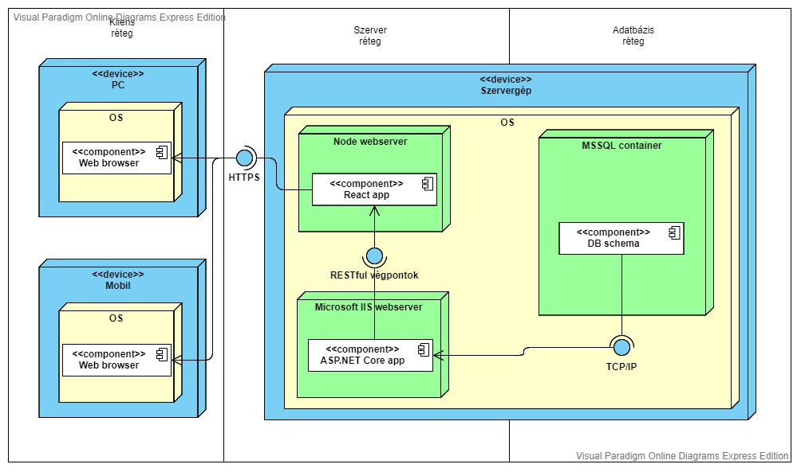
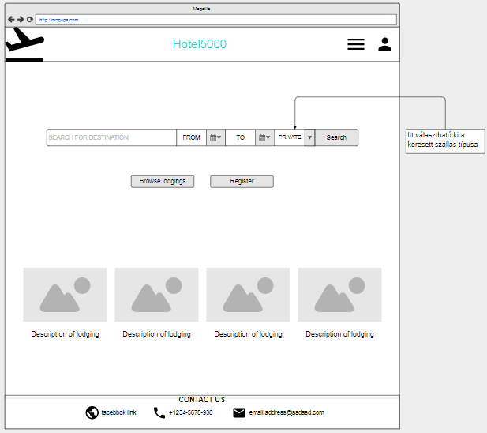
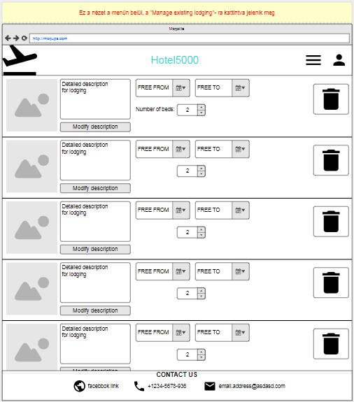

# Hotel5000 rendszerterv

## Bevezetés

### Szójegyzék és rövidítések

Rövidítés | Magyarázat | 
--------- | ----------
interface | nem konkrét programozási értelemben vett interface, hanem az applikáció  vagy komponens egy végpontja, elérési módja |

### Architektúra áttekintése

## Rendszer architektúra

### Szoftver architektúra

### Entitás reláció diagram

### Képernyőtervek
#### Kezdőképernyő

#### Saját profil

#### Menü

#### Saját, meglévő hirdetések menedzselése

#### Komponensek
a fenti diagramból a komponensek leírása

Komponens neve | Magyarázat |
-------------- | ---------- |
#### Interfacek

Azonosító | Név | Magyarázat |
--------- | --- | ---------- |

### Adatbázisréteg felépítése
szöveg ide
#### Adatbázis(ok)
##### Domain adatbázis
Tulajdonságok | Konfiguráció |
------------- | ------------ |
Név | LodgingDatabase
Technológia | MSSQL via Code-First EF Core
Collation | Latin1_General_CI_AS
Egyéb |
##### Adatmodell

##### Adatbázis objektumok
Role

Mező név | Típus/hossz | Kötelező | Érték/validáció | Kulcs | Megj. |
-------- | ----------- | -------- | --------------- | ----- | ----- |
Id | int | igen | auto-increment | PK | |
Name | varchar(45) | igen | | | ADMIN, APPROVED_USER, COMPANY |

Role megszorítások

Azonosító | Tábla 1 | Mező 1 | Tábla 2 | Mező 2 | Típus |
--------- | ------- | ------ | ------- | ------ | ----- |
Role_PK | Role | Id | | | PK |

User

Mező név | Típus/hossz | Kötelező | Érték/validáció | Kulcs | Megj. |
-------- | ----------- | -------- | --------------- | ----- | ----- |
Id | int | igen | auto-increment | PK | |
Username | varchar(100) | igen | hossz > 4 | | |
Password | varchar(500) | igen | hossz > 8, tartalmaz 1 számot és nagybetűt | | |
Email | varchar(255) | igen | valid email cím | | |
FirstName | varchar(100) | igen | | | |
LastName | varchar(100) | igen | | | |
Role_Id | int | igen | | FK | |
AddedAt | datetime | igen | | | |
ModifiedAt | datetime | igen | | | |
IsDeleted | int | igen | 0 vagy 1 | | |

User megszorítások

Azonosító | Tábla 1 | Mező 1 | Tábla 2 | Mező 2 | Típus |
--------- | ------- | ------ | ------- | ------ | ----- |
User_PK | User | Id | | | PK |
User_Role_FK | Role | Id | User | Role_Id | FK 1-N |

ApprovingData

Mező név | Típus/hossz | Kötelező | Érték/validáció | Kulcs | Megj. |
-------- | ----------- | -------- | --------------- | ----- | ----- |
Id | int | igen | auto-increment | PK | |
IdentityNumber | char(8) | nem | | | személyi azonosító szám |
TaxNumber | char(13) | nem | | | adószám |
RegistrationNumber | char(12) | nem | | | cégjegyzék szám |
User_Id | int | igen | | FK | |
AddedAt | datetime | igen | | | |
ModifiedAt | datetime | igen | | | |
IsDeleted | int | igen | 0 vagy 1 | | |

ApprovingData megszorítások

Azonosító | Tábla 1 | Mező 1 | Tábla 2 | Mező 2 | Típus |
--------- | ------- | ------ | ------- | ------ | ----- |
ApprovingData_PK | ApprovingData | Id | | | PK |
ApprovingData_User_FK | User | Id | ApprovingData | User_Id | FK 1-1|

Contact

Mező név | Típus/hossz | Kötelező | Érték/validáció | Kulcs | Megj. |
-------- | ----------- | -------- | --------------- | ----- | ----- |
Id | int | igen | auto-increment | PK | |
MobileNumber | varchar(13) | igen | | | |
User_Id | int | igen | | FK | |
AddedAt | datetime | igen | | | |
ModifiedAt | datetime | igen | | | |
IsDeleted | int | igen | 0 vagy 1 | | |

Contact megszorítások

Azonosító | Tábla 1 | Mező 1 | Tábla 2 | Mező 2 | Típus |
--------- | ------- | ------ | ------- | ------ | ----- |
Contact_PK | Contact | Id | | | PK |
Contact_User_FK | User | Id | Contact | User_Id | FK 1-N |

Lodging

Mező név | Típus/hossz | Kötelező | Érték/validáció | Kulcs | Megj. |
-------- | ----------- | -------- | --------------- | ----- | ----- |
Id | int | igen | auto-increment | PK | |
Name | varchar(255) | igen | | | | |
User_id | int | igen | | FK | |
AddedAt | datetime | igen | | | |
ModifiedAt | datetime | igen | | | |
IsDeleted | int | igen | 0 vagy 1 | | |

Lodging megszorítások

Azonosító | Tábla 1 | Mező 1 | Tábla 2 | Mező 2 | Típus |
--------- | ------- | ------ | ------- | ------ | ----- |
Lodging_PK | Lodging | Id | | | PK |
Lodgind_User_FK | User | Id | Lodging | User_Id | FK 1-N |

Country

Mező név | Típus/hossz | Kötelező | Érték/validáció | Kulcs | Megj. |
-------- | ----------- | -------- | --------------- | ----- | ----- |
Id | int | igen | auto-increment | PK | |
CountryCode | char(2) | igen | | | az ország ISO 3166-1 alpha-2 kódja |
CountryName | varchar(100) | igen | | | az ország teljes neve |
AddedAt | datetime | igen | | | |
ModifiedAt | datetime | igen | | | |
IsDeleted | int | igen | 0 vagy 1 | | |

Country megszorítások

Azonosító | Tábla 1 | Mező 1 | Tábla 2 | Mező 2 | Típus |
--------- | ------- | ------ | ------- | ------ | ----- |
Country_PK | Country | Id | | | PK |

LodgingAddress

Mező név | Típus/hossz | Kötelező | Érték/validáció | Kulcs | Megj. |
-------- | ----------- | -------- | --------------- | ----- | ----- |
Id | int | igen | auto-increment | PK | |
Country_Id | int | igen | | FK | |
County | varchar(100) | igen | | | |
City | varchar(100) | igen | | | |
PostalCode | varchar(10) | igen | | | irányítószám |
Street | varchar(100) | igen | | | |
HouseNumber | varchar(10) | igen | | | házszám |
Floor | varchar(10) | nem | | | tömbház esetén emelet |
DoorNumber | varchar(10) | nem | | | tömbház/apartman esetén ajtó száma |
Lodgind_Id | int | igen | | FK | |
AddedAt | datetime | igen | | | |
ModifiedAt | datetime | igen | | | |
IsDeleted | int | igen | 0 vagy 1 | | |

LodgingAddress megszorítások

Azonosító | Tábla 1 | Mező 1 | Tábla 2 | Mező 2 | Típus |
--------- | ------- | ------ | ------- | ------ | ----- |
LodgingAddress_PK | LodgingAddress | Id | | | PK |
LodgingAddress_Country_FK | Country | Id | LodgingAddress | Country_Id | FK 1-N |
LodgingAddress_Lodging_FK | Lodging | Id | LodgingAddress | Lodging_Id | FK 1-N |

ReservationWindow

Mező név | Típus/hossz | Kötelező | Érték/validáció | Kulcs | Megj. |
-------- | ----------- | -------- | --------------- | ----- | ----- |
Id | int | igen | auto-increment | PK | |
From | datetime | igen | | | mikortól szabad a szállás |
To | datetime | igen | | | meddig szabad a szállás |
Lodging_Id | int | igen | | FK | |
AddedAt | datetime | igen | | | |
ModifiedAt | datetime | igen | | | |
IsDeleted | int | igen | 0 vagy 1 | | |

ReservationWindow megszorítások

Azonosító | Tábla 1 | Mező 1 | Tábla 2 | Mező 2 | Típus |
--------- | ------- | ------ | ------- | ------ | ----- |
ReservationWindow_PK | ReservationWindow | Id | | | PK |
ReservationWindow_Lodging_FK | Lodging | Id | ReservationWindow | Logding_Id | FK 1-N |

Room

Mező név | Típus/hossz | Kötelező | Érték/validáció | Kulcs | Megj. |
-------- | ----------- | -------- | --------------- | ----- | ----- |
Id | int | igen | auto-increment | PK | |
AdultCapacity | int | igen | | | felnőtt férőhely |
ChildrenCapacity | int | igen | | | gyerek férőhely |
ReservationWindow_Id | int | igen | | FK | |
AddedAt | datetime | igen | | | |
ModifiedAt | datetime | igen | | | |
IsDeleted | int | igen | 0 vagy 1 | | |

Room megszorítások

Azonosító | Tábla 1 | Mező 1 | Tábla 2 | Mező 2 | Típus |
--------- | ------- | ------ | ------- | ------ | ----- |
Room_PK | Room | Id | | | PK |
Room_ReservationWindow_FK | ReservationWindow | Id | Room | ReservationWindow_Id | FK 1-N |

PaymentType

Mező név | Típus/hossz | Kötelező | Érték/validáció | Kulcs | Megj. |
-------- | ----------- | -------- | --------------- | ----- | ----- |
Id | int | igen | auto-increment | PK | |
Name | varchar(100) | igen | | | fizetési mód megnevezése |

PaymentType megszorítások

Azonosító | Tábla 1 | Mező 1 | Tábla 2 | Mező 2 | Típus |
--------- | ------- | ------ | ------- | ------ | ----- |
PaymentType_PK | PaymentType | Id | | | PK |

UserReservation

Mező név | Típus/hossz | Kötelező | Érték/validáció | Kulcs | Megj. |
-------- | ----------- | -------- | --------------- | ----- | ----- |
Id | int | igen | auto-increment | PK | |
Email | varchar(255) | igen | | | |
ReservedFrom | datetime | igen | | | foglalás kezdete |
ReservedTo | datetime | igen | | | foglalás vége |
ReservationWindow_Id | int | igen | | FK | |
PaymentType_Id | int | igen | | FK | |
AddedAt | datetime | igen | | | |
ModifiedAt | datetime | igen | | | |
IsDeleted | int | igen | 0 vagy 1 | | |

UserReservation megszorítások

Azonosító | Tábla 1 | Mező 1 | Tábla 2 | Mező 2 | Típus |
--------- | ------- | ------ | ------- | ------ | ----- |
UserReservation_PK | UserReservation | Id | | | PK |
UserReservation_ReservationWindow_FK | ReservationWindow | Id | UserReservation | ReservationWindow_Id | FK 1-N |
UserReservation_PaymentType_FK | PaymentType | Id | UserReservation | PaymentType_Id | FK 1-N |

ReservedRoom

Mező név | Típus/hossz | Kötelező | Érték/validáció | Kulcs | Megj. |
-------- | ----------- | -------- | --------------- | ----- | ----- |
Id | int | igen | auto-increment | PK | |
UserReservation_Id | int | igen | | FK | |
Room_Id | int | igen | | FK | |
AddedAt | datetime | igen | | | |
ModifiedAt | datetime | igen | | | |
IsDeleted | int | igen | 0 vagy 1 | | |

ReservedRoom megszorítások

Azonosító | Tábla 1 | Mező 1 | Tábla 2 | Mező 2 | Típus |
--------- | ------- | ------ | ------- | ------ | ----- |
ReservedRoom_PK | ReservedRoom | Id | | | PK |
ReservedRoom_UserReservation_FK | UserReservation | Id | ReservedRoom | UserReservation_Id | FK 1-N |
ReservedRoom_Room_FK | Room | Id | ReservedRoom | Room_Id | FK 1-N |

## Követelmények megvalósítása

URS azonosító | Kapcsolódó komponensek azonosítói | Egyéb |
------------- | --------------------------------- | ----- |
admin_login | Authentication | |
admin_moderate | Admin supervisement | |
admin_supervise | Admin supervisement | |
bu_browse | User reserving | |
bu_search | User reserving | |
bu_reserve | User reserving | |
bu_cancel | User reserving | |
bu_rate | User reserving | |
au_register	| Authentication | |
au_login | Authentication | |
au_post | Lodging management | |
au_modify | Lodging management | |
au_delete | Lodging management | |
c_register | Authentication | |
c_login | Authentication | |
c_post | Lodging management | |
c_modify | Lodging management | |
c_delete | Lodging management | |

## Biztonság
leírni a titkosítási módszereket, hibakezelési módszereket stb.

## Naplózás és monitorozás
kifejteni a naplózás módját és szintjeit (pl rendszerinformáció, figyelmeztetés, hibaüzenet stb)

## Környezet-függő paraméterek
Paraméter neve | Érték DEV környezetben |
-------------- | ---------------------- |
